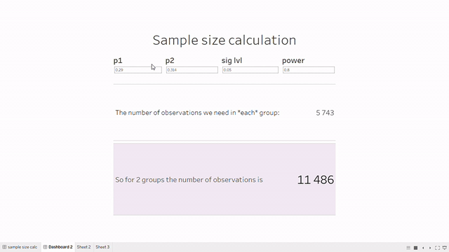

Сегодня будем делать свой калькулятор подсчета выборки для АБ-теста на биномиально распределенную величину (конверсию) прямо в Tableau (ну или почти)

Для начала создадим параметры, с помощью которых наш пользователь будет вводить базовое и ожидаемое значение конверсии, а также статистические параметры - уровень значимости и мощность.

Давайте посмотрим, как вычисляется количество наблюдений, необходимых для статистической значимости при заданных параметрах: 
`SCRIPT_INT('a = power.prop.test(p1 = .arg1, p2 = .arg2, sig.level = .arg3, power = .arg4)
a$n',[p1],[p2],[sig lvl], [power] )`

Возможно вы заметили, что внутри вычислимого поля находится код на R - так и есть. И в этот код мы с помощью параметров `.arg_` передаем локальные переменные из tableau.

**Что сделать, чтобы скрипт на R выполнялся?**

Открываем R или RStudio, вводим 3 строчки
`install.packages("Rserve")
library(Rserve)
Rserve()`

Что в них происходит? 

Первые 2 строчки скачивают и импортят библиотеку Rserve, третья запускает функцию оттуда. Давайте посмотрим, что это за библиотека: 
`help(Rserve)`
>Server providing R functionality to applications via TCP/IP or local unix sockets

Мы локально запустили сервер с R, к которому может обращаться наше табло. То есть табло не "на месте" подсчитывает данные, а стучится в R с со всеми переданными параметрами и записывает в переменную результат выполнения.

Чтобы это все взлетело, остался **еще штрих** - нужно показать табло, куда стучаться. 
Локально делается так: `Help->Setting and Performance -> Manage External Service Connection`.
Выбираем *localhost*, проверяем подключение, взлетаем 🚀
